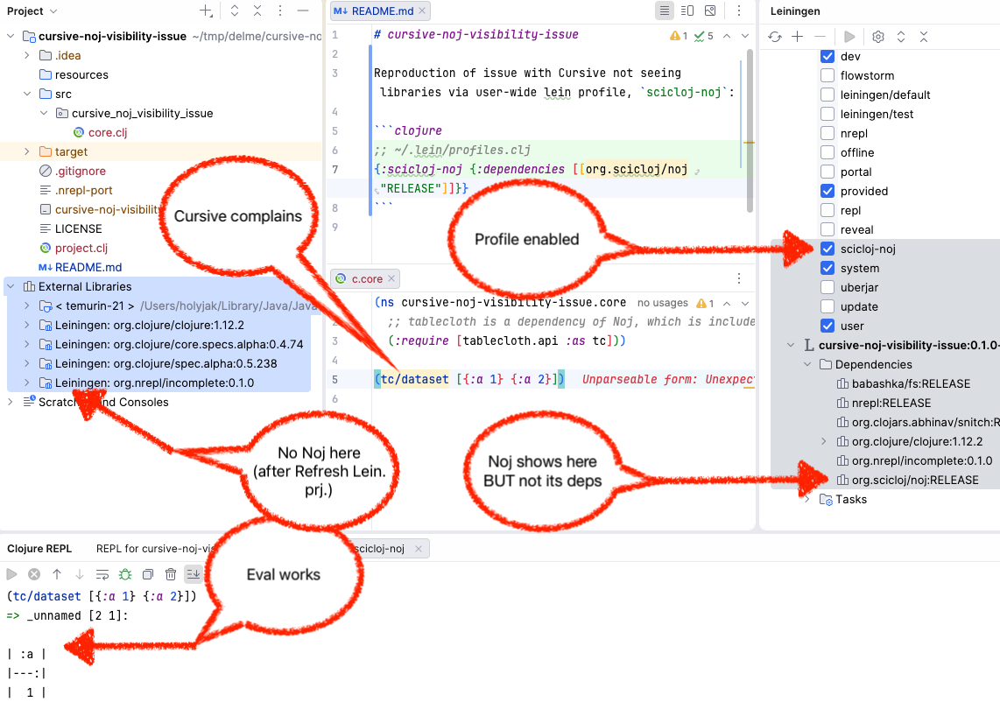

# cursive-noj-visibility-issue

Reproduction of issue with Cursive not seeing libraries via user-wide lein profile, `scicloj-noj`:

```clojure
;; ~/.lein/profiles.clj
{:scicloj-noj {:dependencies [[org.scicloj/noj "RELEASE"]]}}
```

See 

## Steps to reproduce:

1. Have  user-wide Leiningen profile `scicloj-noj` as shown above
2. Open this project in IntelliJ + Cursive
3. In the Leiningen tool, check the `scicloj-noj` profile and then the Refresh Leiningen Projects button
4. Run nrepl with Lein, with `Profiles: +scicloj-noj`
5. Evaluate the code in `core.clj`

### Actual results

Evaluation works just fine but 
1. Cursive complains that `tc/dataset` cannot be resolved
2. The [dependencies of Noj](https://clojars.org/org.scicloj/noj), such as tablecloth, do not show up in the Leiningen window
3. Noj itself doesn't show in the Project window under External Libraries
4. As mentioned, "Send to repl" works but Cursive reports "Unparseable form: Unexpected content after form"

### Expected results

1. Cursive does not complain about anything
2. Noj and its dependencies show up in Project → External Libraries
3. I can command-click to navigate to the library and its vars

### Versions

IntelliJ IDEA 2025.3, Build #IU-253.28294.334, built on December 5, 2025
macOS 15.7.3
com.cursiveclojure.cursive (2025.2.1-253)
