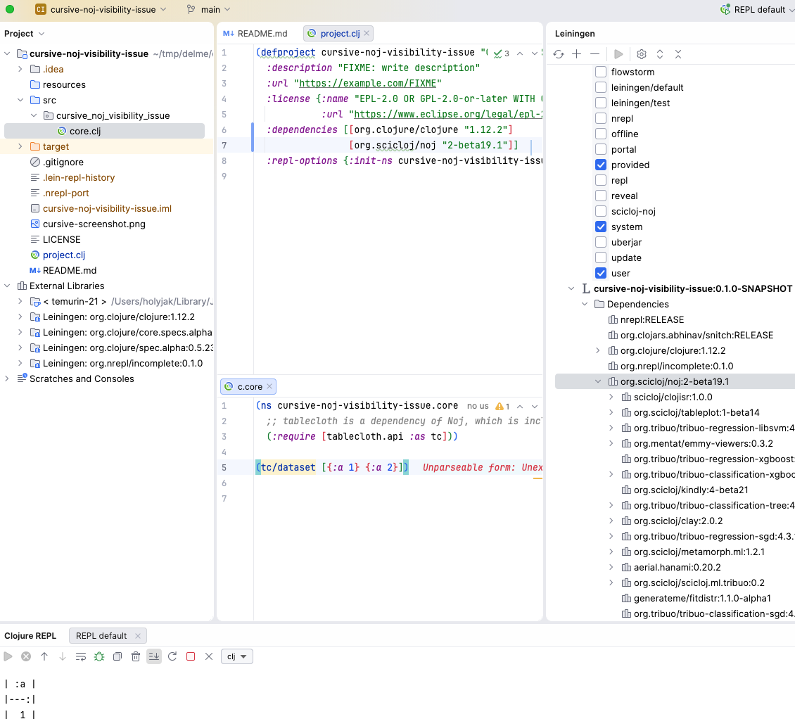

# cursive-noj-visibility-issue

Reproduction of issue with Cursive not seeing the dependencies of Noj, in a Leiningen project. 
REPL works fine but Cursive complains about unresolved vars.

Notice that Noj itself uses deps, but its generated `pom.xml` has the correct dependencies in place:

```xml
cat ~/.m2/repository/org/scicloj/noj/2-beta19.1/noj-2-beta19.1.pom
...
  <dependencies>
    ...
    <dependency>
      <groupId>scicloj</groupId>
      <artifactId>tablecloth</artifactId>
      <version>7.042</version>
    </dependency>

```

The library itself looks fine as well:

```
unzip -l ~/.m2/repository/scicloj/tablecloth/7.042/tablecloth-7.042.jar 
Name
----
META-INF/MANIFEST.MF
META-INF/maven/scicloj/tablecloth/pom.xml
META-INF/leiningen/scicloj/tablecloth/project.clj
...
tablecloth/api/
tablecloth/api/join_separate.clj
tablecloth/api/dataset.clj
```

In Calva there are no problems. (But it likely doesn't rely on static code analysis.)

## Attempt 1: Noj via user-wide lein profile

First, I tried to include Noj via a user-wide lein profile, instead of adding it directly to the project:

```clojure
;; ~/.lein/profiles.clj
{:scicloj-noj {:dependencies [[org.scicloj/noj "RELEASE"]]}}
```

See 

### Steps to reproduce:

1. Have  user-wide Leiningen profile `scicloj-noj` as shown above
2. Open this project in IntelliJ + Cursive
3. In the Leiningen tool, check the `scicloj-noj` profile and then the Refresh Leiningen Projects button
4. Run nrepl with Lein, with `Profiles: +scicloj-noj`
5. Evaluate the code in `core.clj`

#### Actual results

Evaluation works just fine but 
1. Cursive complains that `tc/dataset` cannot be resolved
2. The [dependencies of Noj](https://clojars.org/org.scicloj/noj), such as tablecloth, do not show up in the Leiningen window
3. Noj itself doesn't show in the Project window under External Libraries
4. As mentioned, "Send to repl" works but Cursive reports "Unparseable form: Unexpected content after form"

#### Expected results

1. Cursive does not complain about anything
2. Noj and its dependencies show up in Project → External Libraries
3. I can command-click to navigate to the library and its vars

## Attempt 2: noj as a direct dependency

When I forego the user profile and instead add Noj as a direct Leiningen dependency than I get almost the same problems as above,
the only difference is that the Leiningen window now shows Noj's dependencies:

See 

## Versions

```
IntelliJ IDEA 2025.3, Build #IU-253.28294.334, built on December 5, 2025
macOS 15.7.3
com.cursiveclojure.cursive (2025.2.1-253)
```